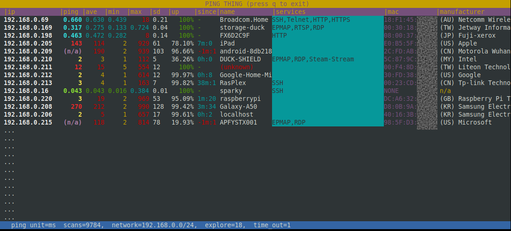

# pingthing

Summary of your local network (htop style).  
In Alpha release ATM.

This utility was created because I needed to inspect my local network, and most of the tools to do so were 
inadequate or overly cumbersome.

#### Design goals:  
  - No configuration files and a simple install.
  - At a glance view of current, best, worst, average ping.
  - Reliably just work.
  - Port scan only the 1% of ports 99% of people care about.
  - Decide what information is useful, not "shop for stuff to show".

#### Usage
    Command line optional arguments:
      -h, --help           show this help message and exit
      --range RANGE        network range, eg: 192.168.0.0/24
      --time_out TIME_OUT  time out for ping, in whole seconds
      --view VIEW          Columns to show 
                           defaults to: flag,ip,ping,mean,best,worst,sd,up-time,last-outage,name,services,mac,manufacturer
      --bw                 Black/white mode (colour blind safe).

NB: to quite press 'q'

#### Installation
    # To install
    git clone git@github.com:busyDuckman/pingthing.git
    cd pingthing
    pip3 install requirements.txt
    
    # To run
    ./pingthing.py

#### Licence 
Licenced under the MIT License, see LICENSE for details.

#### Consciences Cognizance, Cataloging Contributions:

  - MAC data from http://standards-oui.ieee.org/oui/oui.csv  
  - [Ray](https://ray.io/) [Apache 2.0]  
  - [Asciimatics](https://github.com/peterbrittain/asciimatics) [Apache-2.0]  
  - [get-mac](https://github.com/GhostofGoes/getmac) [MIT]  
    